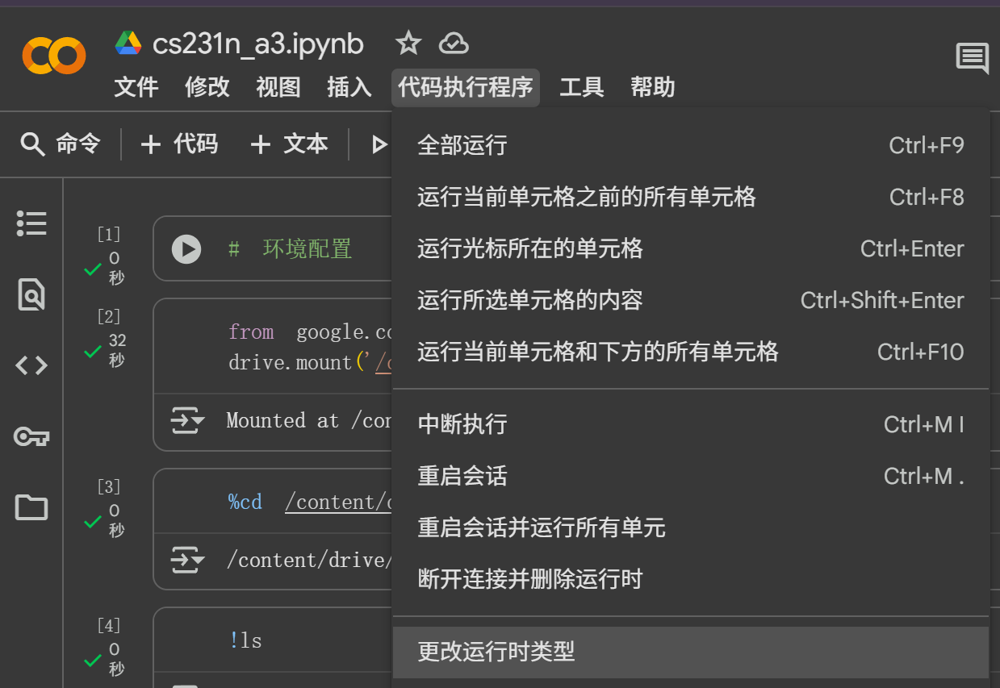
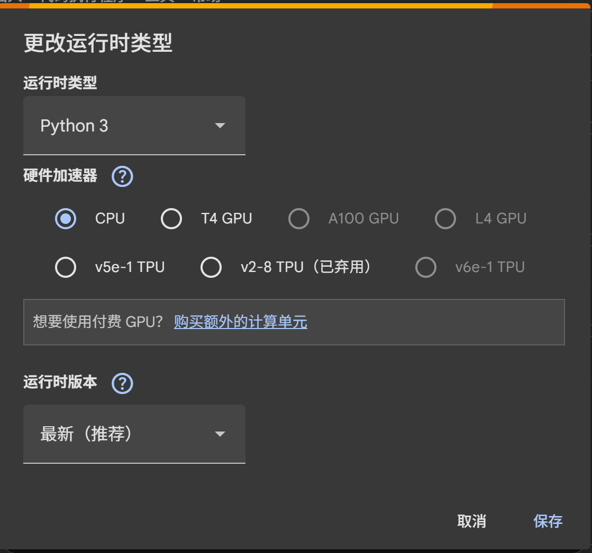

### 环境

本人所有的代码都是在colab上运行的。
## a1

对于a1，在jupter book前加入

```
from google.colab import drive
drive.mount('/content/drive')
```

```
%cd /content/drive/My\ Drive/cs224n/a1/student/
```

```
!ls
```

```
!pip install gensim datasets==2.18.0
```

即可。

## a2

对于a2，创建一个jupter book，并且输入

```
from google.colab import drive
drive.mount('/content/drive')
```

```
%cd /content/drive/My\ Drive/cs224n/a2/student-1/
```

```
!ls
```

```
!pip install torch torchvision tqdm docopt
```

由于a2没有像a1那样有明确的jupter book指导文档，这里说一下大概要干什么。

https://web.stanford.edu/class/cs224n/assignments_w25/a2.pdf

其实文档是这里，但是没人愿意看又臭又长的论文。

首先打开`parser_transitions.py`，将SHIFT, LEFT-ARC, RIGHT-ARC的规则写出来，然后打开`parser_model.py`，搭建神经网络，搭建完毕之后写`run.py`，然后运行即可。

具体的流程见a2.md（这个有点乱，有机会整理）。

另外，在运行的时候要改为gpu环境




### a3

https://web.stanford.edu/class/cs224n/assignments_w25/a3.pdf

论文来自于这里，要干嘛看a3.md

环境配置如下：

创造一个jupter book，然后输入以下指令——

```
from google.colab import drive
drive.mount('/content/drive')
```

```
%cd /content/drive/My\ Drive/cs224n/a3/student/
```

```
!ls
```

```
!pip install -r requirements.txt
```

如果没有报错，那么就说明环境配置的没什么很大问题
```
!python sanity_check.py
```

测试运行的时候有这几个问题——

第一，测试`python sanity_check.py 1d`的时候，不能使用gpu

第二，不需要二次剪裁，如果剪裁了，那么`python sanity_check.py 1e`检查过不了

第三，即便是二次剪裁了，`python sanity_check.py 1f`也能过，但是run就过不了了。

第四，

在 Colab 左侧的文件浏览器中，找到 `student` 文件夹，然后双击打开里面的 `beam_search_diagnostics.py` 文件。

在打开的文件中，找到 `get_diagnostic_info` 这个函数，大概在第19行左右。你会看到这一行：

`"u": os.getlogin()`

改为

`"u": "any_name_you_like"`

第五，

将`run.py` 文件的第 `281` 行：

```
params = torch.load(model_save_path, map_location=lambda storage, loc: storage)
```

改为

```
params = torch.load(model_save_path, map_location=lambda storage, loc: storage, weights_only=False)
```

第六，

打开 `nmt_model.py` 文件，找到第 `551` 行，将

```
params = torch.load(model_save_path, map_location=lambda storage, loc: storage)
```

改为

```
params = torch.load(model_save_path, map_location=lambda storage, loc: storage, weights_only=False)
```

然后运行，得在colab上跑30分钟多

```
!sh run.sh train
```

最后运行，得在colab上跑

```
!sh run.sh test
```

最后结果得出来

```
Decoding: 100% 1001/1001 [00:36<00:00, 27.33it/s]
Corpus BLEU: 19.959350420896126
```

a4有机会再写了，先写到这里结束，估计a4应该和cs231n的a3.2差不多

